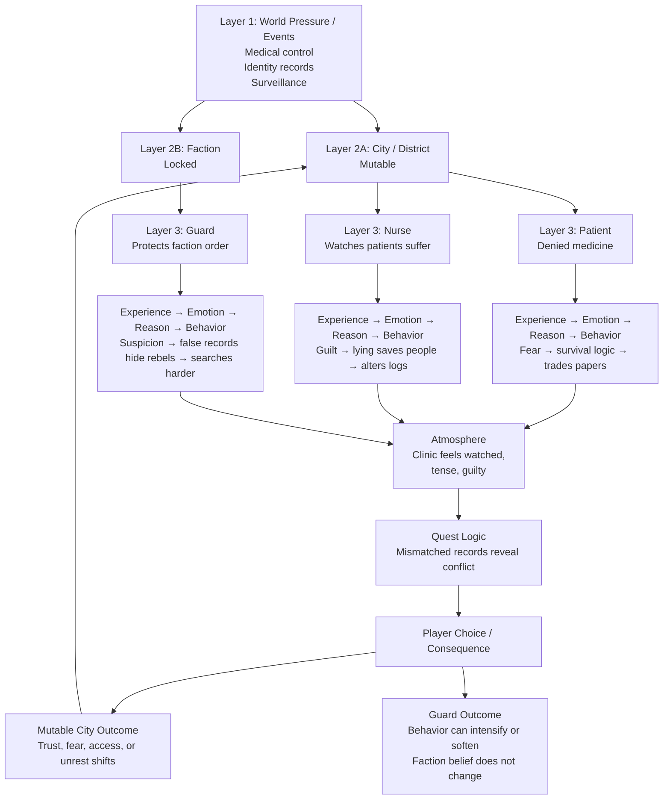

# Three-Layer Quest Method

This diagram shows the method layout used in the quest test. The positions matter:

- The left side is the mutable city/district path.
- The right side is the locked faction path.
- Local NPCs and faction NPCs both pass through the same core method.
- Player consequence can update the city layer.
- The guard can respond, but faction belief stays locked.

## Read Order

**Layer 1 — World Pressure / Events**  
Large forces shape the setting: medical control, identity records, surveillance.

**Layer 2A — City / District**  
Mutable. Local trust, fear, access, and unrest can shift through player consequence.

**Layer 2B — Faction**  
Locked. Doctrine and core beliefs do not change because of one quest.

**Layer 3 — NPC Types**  
Patient, nurse, and guard experience the same pressure differently.

**Core Method**  
Experience → Emotion → Reason → Behavior → Atmosphere → Quest Logic

**Outcome Rule**  
The mutable city layer can change. The guard can respond, but the faction belief remains locked.