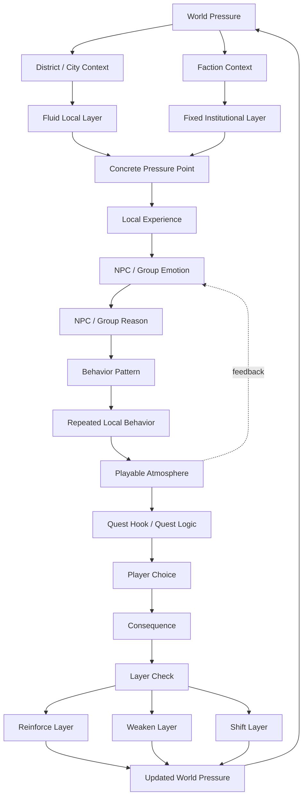

# World Pressure to Quest Consequence Loop

This diagram shows how world pressure becomes NPC or group behavior, how repeated behavior creates playable atmosphere, and how player choices feed back into the world state.



## Reading the Loop

**World Pressure** is the larger force acting on the setting: occupation, scarcity, religious control, class collapse, disease, debt, exile, or institutional fear.

That pressure is filtered through two kinds of context:

- **Fluid Local Layer**: districts, crowds, gangs, shops, neighborhoods, rumors, and unstable local moods.
- **Fixed Institutional Layer**: factions, doctrine, law, hierarchy, military command, religion, and characters whose role is structurally locked.

Together, those layers create a **Concrete Pressure Point**: a specific place where the pressure becomes visible and playable.

The important chain is:

```text
Pressure Point
→ Local Experience
→ NPC / Group Emotion
→ NPC / Group Reason
→ Behavior Pattern
```

This prevents NPCs from feeling like puppets. They are not reacting directly to abstract lore. They are reacting to what the pressure makes them experience.

Repeated behavior creates **Playable Atmosphere**. Atmosphere is not just description; it appears through repeated local actions, restrictions, silence, patrols, queues, closed doors, altered dialogue, and changed routines.

That atmosphere creates or supports **Quest Logic**. The player then makes a choice, and the consequence is checked against the affected layer.

A consequence can:

- **Reinforce Layer**: make the existing pressure stronger or more accepted.
- **Weaken Layer**: reduce confidence, control, belief, or stability.
- **Shift Layer**: meaningfully change the local state, without necessarily rewriting the whole world.

The result becomes **Updated World Pressure**, feeding the next cycle.

## Design Rule

Not every player action should change every layer.

A local choice may shift a district, weaken a faction's influence, or reinforce a rumor, but it should not instantly rewrite fixed institutions unless the story has built enough pressure for that change.

## Example

```text
World Pressure: Medical dependency
↓
District / City Context: Devaar clinic district
↓
Fluid Local Layer: patients rely on rationed medicine
↓
Fixed Institutional Layer: hospital authority controls access
↓
Concrete Pressure Point: medicine records are falsified
↓
Local Experience: a clinic worker watches patients denied treatment
↓
Emotion: fear, guilt, resentment
↓
Reason: "If the records stay hidden, people keep dying quietly."
↓
Behavior Pattern: the worker hides copies of treatment logs
↓
Repeated Local Behavior: staff whisper, doors close early, patients wait silently
↓
Playable Atmosphere: medical fear and institutional silence
↓
Quest Hook: player discovers the hidden records
↓
Player Choice: expose, protect, or exploit the records
↓
Consequence: layer is reinforced, weakened, or shifted
↓
Updated World Pressure
```
