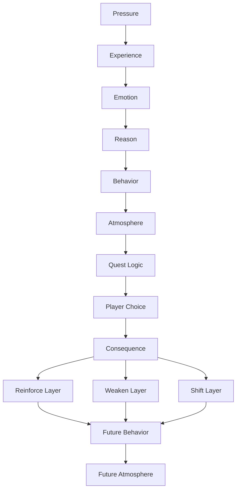

# Fragments

I'm Diogo Oliveira. I currently work full-time in glass manufacturing, and I am building **Fragments** outside of work as a hobby project.

This project is very early. I started **Fragments** on **20/05/2026**. The worldbuilding began on **05/06/2026**, and the NPC / quest method started on **07/06/2026**.

I am not presenting this as finished professional game development work.

I am presenting it as a record of what I am trying to understand and test.

Through this project, I am testing:

- whether emotional causes can make lore feel less random
- whether character wounds can grow into family patterns and world systems
- whether a repeated detail can become a clue, then a reveal, then a payoff
- whether world pressure can lead toward quests, conflicts, and consequences
- whether a layer-based method can help NPCs, districts, factions, and quests react without breaking immersion

## What This Repository Shows

This repository is not meant to show a finished game.

It is meant to show how I am learning to build connected worldbuilding, character logic, NPC behavior, atmosphere, and quest structure.

What I am focused on right now is the Erit worldbuilding branch, where I am testing whether world pressure can create believable factions, NPCs, quests, and consequences instead of treating them as separate pieces.

## Current Method Finding

While building Erit's world, I started documenting a method for making worldbuilding, factions, NPCs, atmosphere, and quests feel connected through cause and consequence.

The first worldbuilding chain used for Viriatus, House Ventari, and the family foundation was:

> Pressure → Experience → Emotion → Reason → Behavior

From that foundation, later testing added **Atmosphere** as the result of repeated behavior:

> Pressure → Experience → Emotion → Reason → Behavior → Atmosphere

Testing later added **Layers**, which explain why different cities, factions, districts, or NPCs can experience similar pressure but react differently.

For quests, the test expanded into:

> Starting Layer → Pressure → Experience → Emotion → Reason → Behavior → Atmosphere → Quest Logic → Player Choice → Consequence → Possible Layer Outcome

The main finding so far is that behavior and atmosphere often do not need to be forced separately. When the earlier steps are clear, behavior tends to appear naturally. When behavior repeats across a place, group, or NPC, atmosphere begins to appear. Quests can then be found inside that atmosphere instead of being placed on top of it.

This simplified loop shows the tested method: pressure creates experience, experience creates emotion, emotion creates reason, and reason creates behavior. Atmosphere was added later after testing showed that repeated behavior could make the world feel coherent. Quests can then create player choices and consequences. Those consequences may reinforce, weaken, or shift mutable layers as outcomes. Layer outcomes can shape future behavior, and changed behavior can affect future atmosphere.

Full document:

[Method Creation Examples](Erit_Worldbuilding/00_Method/Method_Creation_Examples.md)

## Start Here

Recommended reading order:

1. [Method Creation Examples](Erit_Worldbuilding/00_Method/Method_Creation_Examples.md)
2. [Erit Worldbuilding Case Study](Portfolio/Erit_Worldbuilding_Case_Study.md)
3. [Worldbuilding Method](Erit_Worldbuilding/00_Method/Worldbuilding_Method.md)
4. [Erit Worldbuilding — Development Diary](Erit_Worldbuilding/Development_Diary/00_Development_Diary.md)
5. [Story Structure / Starting Idea](Portfolio/Development_Process.md)
6. [Portfolio Overview](Portfolio/README.md)

The method examples are the strongest first click because they show how the current process was discovered, tested, and applied across foundation history, factions, layers, NPCs, and quests. The case study shows a shorter public-facing example. The method file shows the hierarchy behind the process. The diary shows the fuller working trail behind the case study and method. The story-structure file shows how Fragments began from images, scenes, and feelings before the larger architecture existed.

## Project Branches

This repository currently contains two connected project branches and one public-facing branch.

### Erit Worldbuilding

[Erit_Worldbuilding/README.md](Erit_Worldbuilding/README.md)

The strongest current branch: Viriatus, House Ventari, Regulatus, founding families, Devaar, identity control, medical dependency, NPC behavior, quest pressure, and the world Erit inherits.

### Fragments Story

[Fragments_Story/README.md](Fragments_Story/README.md)

The main story branch: prose, characters, acts, Unity, scene bridges, emotional payoff, and reader perception.

### Portfolio

[Portfolio/README.md](Portfolio/README.md)

A shorter public-facing branch with clean summaries, selected samples, and learning-process notes. This is useful for a quick overview, but it is not the full development trail.

## Worldbuilding Process

For the shorter case-study version, read:

[Erit Worldbuilding Case Study](Portfolio/Erit_Worldbuilding_Case_Study.md)

For the full working-process version of Erit's worldbuilding, read:

[Erit Worldbuilding — Development Diary](Erit_Worldbuilding/Development_Diary/00_Development_Diary.md)

The diary shows what questions appeared, why details mattered, what connected back to Fragments, and what had to stay constrained so the main story remained intact.

The current worldbuilding method I am testing is documented here:

[Method Creation Examples](Erit_Worldbuilding/00_Method/Method_Creation_Examples.md)

The repo-wide clarity rule is here:

[Canon Clarity Rules](Erit_Worldbuilding/00_Method/Canon_Clarity_Rules.md)

## Repository Structure

- `Erit_Worldbuilding/` — worldbuilding branch for Viriatus, House Ventari, Regulatus, method notes, systems, quests, and the world Erit inherits.
- `Fragments_Story/` — main story branch with project foundation, development history, characters, acts, prose, bridges, cosmology, and reference material.
- `Portfolio/` — shorter public-facing route with the overview, samples, case study, and process notes.

## Note On AI Use

I used AI as a development assistant to help organize, question, and stress-test ideas.

The creative direction, constraints, world logic, character decisions, corrections, and final choices are mine. I used the process to learn faster, not to pretend this is polished professional work.

## Note

This repository is a working record of learning and development, not a finished game portfolio.

The strongest current evidence of the process is in the Erit worldbuilding files. The portfolio route is shorter and cleaner, but it does not contain the full development trail.
