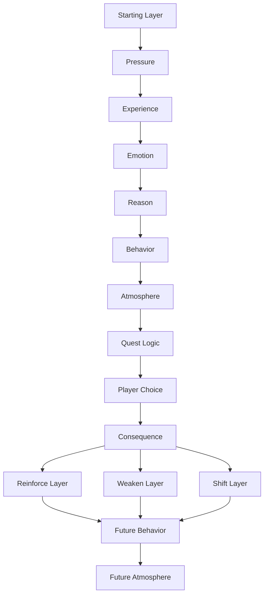

# Fragments

I'm Diogo Oliveira. I currently work full-time in glass manufacturing, and I am building **Fragments** outside of work as a hobby project.

This project is very early. I started **Fragments** on **20/05/2026**. The worldbuilding began on **05/06/2026**, and the NPC / quest method started on **07/06/2026**.

I am not presenting this as finished professional game development work.

I am using this repository to track what I am trying to understand and test.

Through this project, I am testing:

- whether emotional causes can make lore feel less random
- whether character wounds can grow into family patterns and world systems
- whether a repeated detail can become a clue, then a reveal, then a payoff
- whether world pressure can lead toward quests, conflicts, and consequences
- whether a layer-based method can help NPCs, districts, factions, and quests react without breaking immersion

## What This Repository Is For

This is a working record, not a finished game.

My current focus is the Erit worldbuilding branch, where I am testing whether world pressure can create factions, NPCs, quests, and consequences that feel connected instead of separate.

## Current Method

While building Erit's world, I started writing down a method for connecting worldbuilding, factions, NPCs, atmosphere, and quests through cause and consequence.

The first worldbuilding chain used for Viriatus, House Ventari, and the family foundation was:

> Pressure → Experience → Emotion → Reason → Behavior

Later testing added **Atmosphere** as the result of repeated behavior:

> Pressure → Experience → Emotion → Reason → Behavior → Atmosphere

After that, I added **Layers** to explain why different cities, factions, districts, or NPCs can experience similar pressure but react differently.

For quests, the method is being tested like this:

> Starting Layer → Pressure → Experience → Emotion → Reason → Behavior → Atmosphere → Quest Logic → Player Choice → Consequence → Possible Layer Outcome



### Twine Prototype

On 2026-06-08, I began testing this method in Twine through a small Vys prototype.

The prototype currently uses three layers:

- Layer 1 — City / World State
- Layer 2 — Faction Pressure
- Layer 3 — NPC / Local Behavior

Layer 2 and Layer 3 influence each other's effectiveness, but they do not change each other's identity.

Faction actions remain faction actions. NPC behavior remains NPC behavior.

Both feed into shared city pressure, and that pressure can change the city state. The changed city state then affects future NPC behavior, faction access, location mood, and quest logic.

The goal is to test whether quests can create systemic consequences instead of isolated scripted outcomes.

Current simplified implementation:

```text
Faction Action -> Layer 2
NPC Behavior -> Layer 3

Layer 2 + Layer 3 -> Pressure
Pressure -> Layer 1 City State
Layer 1 -> Future Behavior / Atmosphere / Quest Logic
```

This Twine prototype is not a finished game section. It is a systems test for the pressure, layer, NPC, faction, and quest method.

This is the simplified loop I am testing. A consequence may reinforce or weaken the effectiveness of a layer, and enough accumulated pressure may shift the city state. This can change future behavior, and repeated behavior can change atmosphere.

For a shorter version, start with the Method Summary below. The full method document is linked from there.

## Start Here

These are the shortest entry points.

1. [Method Summary](Portfolio/Summaries/Method_Summary.md)  
   Short version of the pressure, layer, NPC, and quest method.

2. [Erit Worldbuilding Summary](Portfolio/Summaries/Erit_Worldbuilding_Summary.md)  
   How the Erit branch grew from a calendar problem into Viriatus, House Ventari, AVD, and Regulatus.

3. [Storybuilding Summary](Portfolio/Summaries/Storybuilding_Summary.md)  
   Short version of the approach to clues, realization, repeated details, and payoff.

4. [Development Process Summary](Portfolio/Summaries/Development_Process_Summary.md)  
   How I am organizing the project and tracking changes over time.

5. [Development Diary Summary](Portfolio/Summaries/Development_Diary_Summary.md)  
   Short version of the working trail from early worldbuilding to the current method tests.

Each summary links to its fuller working document.

## Project Branches

This repository currently has two working branches and one shorter portfolio route.

### Erit Worldbuilding

[Erit_Worldbuilding/README.md](Erit_Worldbuilding/README.md)

The branch I am focused on right now: Viriatus, House Ventari, Regulatus, founding families, Devaar, identity control, medical dependency, NPC behavior, quest pressure, and the world Erit inherits.

### Fragments Story

[Fragments_Story/README.md](Fragments_Story/README.md)

The main story branch: prose, characters, acts, Unity, scene bridges, emotional payoff, and reader perception.

### Portfolio

[Portfolio/README.md](Portfolio/README.md)

The shorter public-facing route with summaries, selected samples, and process notes.

## Repository Structure

- `Erit_Worldbuilding/` — worldbuilding branch for Viriatus, House Ventari, Regulatus, method notes, systems, quests, and the world Erit inherits.
- `Fragments_Story/` — main story branch with project foundation, development history, characters, acts, prose, bridges, cosmology, and reference material.
- `Portfolio/` — shorter public-facing route with summaries, selected samples, case studies, and process notes.

## Note On AI Use

I used AI as a development assistant to help organize, question, and stress-test ideas.

The creative direction, constraints, world logic, character decisions, corrections, and final choices are mine. I used the process to learn faster, not to pretend this is polished professional work.

## Note

This repository is a working record of learning and development, not a finished game portfolio.

The portfolio route is the quickest way to read it. The project folders contain the fuller working trail.